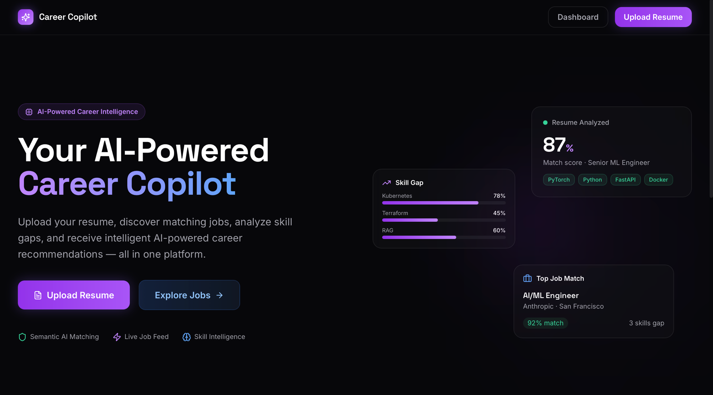
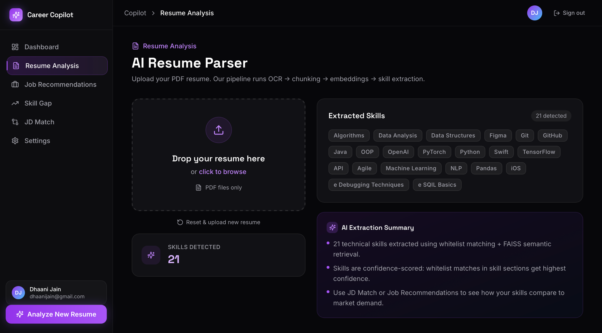
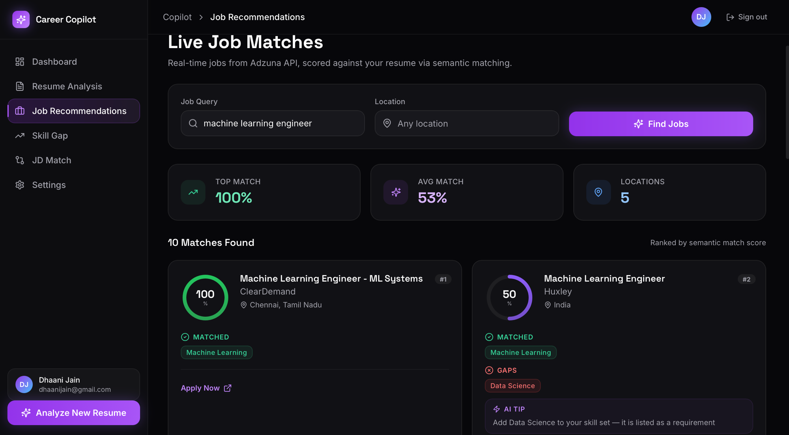
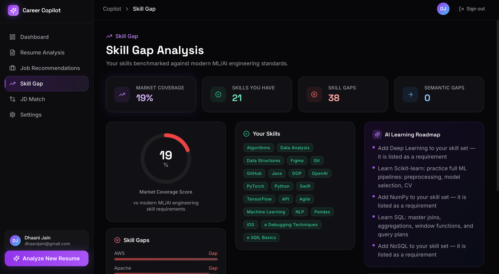

# AI Career Copilot

AI-powered platform that extracts skills from resumes, matches them against job descriptions, identifies skill gaps, and surfaces live job recommendations — all scored via semantic similarity rather than keyword matching.

---

## Table of Contents

- [Features](#features)
- [Screenshots](#screenshots)
- [Architecture](#architecture)
- [Tech Stack](#tech-stack)
- [Project Structure](#project-structure)
- [Environment Variables](#environment-variables)
- [Setup Guide](#setup-guide)
  - [Prerequisites](#prerequisites)
  - [Backend Setup](#backend-setup)
  - [Frontend Setup](#frontend-setup)
- [Running the Application](#running-the-application)
- [API Reference](#api-reference)
- [ML Pipeline Explained](#ml-pipeline-explained)
- [Supabase Setup](#supabase-setup)
- [Logging & Debugging](#logging--debugging)
- [Contributing](#contributing)

---

## Features

| Feature | Description |
|---|---|
| Resume Parsing | PDF text extraction with OCR fallback for scanned/Canva PDFs |
| Skill Extraction | RAG pipeline: FAISS + sentence embeddings + whitelist-first confidence scoring |
| JD Matching | Two-pass matching (exact → semantic cosine ≥ 0.80) with score, gaps, and tips |
| Skill Gap Analysis | Compares resume skills against a JD or market baseline; returns recommendations |
| Live Job Recommendations | Fetches from Adzuna API, ranks results by semantic match score |
| Auth | Optional Supabase JWT auth; results persisted to your account when signed in |

---

## Screenshots

### Landing Page


### Resume Analysis — AI Resume Parser


### Job Recommendations — Live Job Matches


### Skill Gap Analysis


---

## Architecture

```
┌─────────────────────────────────────────────────────────────┐
│                    Next.js 14 Frontend                       │
│   (App Router · Tailwind · Framer Motion · Supabase Auth)   │
└─────────────────────────┬───────────────────────────────────┘
                          │ HTTP  /api/v1/*
┌─────────────────────────▼───────────────────────────────────┐
│                  FastAPI Backend  (Python)                    │
│                                                              │
│  POST /api/v1/upload-resume                                  │
│    └─▶ resume_service → RAG Pipeline                         │
│         pdfplumber → OCR fallback → clean → chunk            │
│         → SentenceTransformer embed → FAISS → skill extract  │
│                                                              │
│  POST /api/v1/match-jd                                       │
│    └─▶ jd_service → skill_extractor → scoring_engine        │
│         exact match + cosine similarity ≥ 0.80              │
│                                                              │
│  POST /api/v1/skill-gap                                      │
│    └─▶ skill_gap_service → scoring_engine                    │
│         resume skills vs JD / market baseline               │
│                                                              │
│  POST /api/v1/recommend-jobs                                 │
│    └─▶ recommendation_engine → Adzuna API → scoring_engine  │
│         live jobs ranked by semantic match                   │
└──────────────────┬──────────────────────┬───────────────────┘
                   │                      │
         ┌─────────▼──────┐    ┌──────────▼────────┐
         │  Supabase DB   │    │  Supabase Storage  │
         │  (PostgreSQL)  │    │  (resume PDFs)     │
         └────────────────┘    └───────────────────-┘
```

---

## Tech Stack

**Backend**

| Package | Purpose |
|---|---|
| FastAPI | REST API framework |
| pdfplumber | PDF text extraction |
| pytesseract + pdf2image | OCR fallback for image-based PDFs |
| sentence-transformers (`all-MiniLM-L6-v2`) | Semantic embeddings |
| FAISS (`faiss-cpu`) | In-memory vector similarity search |
| supabase-py | Auth JWT verification + DB/Storage |
| python-dotenv | Environment variable loading |
| uvicorn | ASGI server |

**Frontend**

| Package | Purpose |
|---|---|
| Next.js 14 (App Router) | React framework |
| Tailwind CSS | Styling |
| Framer Motion | Animations |
| @supabase/supabase-js | Auth + session management |
| lucide-react | Icons |

**Infrastructure**

| Service | Purpose |
|---|---|
| Supabase | Auth, PostgreSQL DB, file storage |
| Adzuna API | Live job listings |

---

## Project Structure

```
ai_career_copilot/
├── app/                          # Core ML pipeline (Python)
│   ├── rag_pipeline.py           # PDF load → OCR → chunk → embed → FAISS → skills
│   ├── skill_extractor.py        # Skill extraction from plain text (JDs)
│   ├── embedding_engine.py       # SentenceTransformer helpers
│   ├── retrieval_engine.py       # FAISS retrieval pipeline
│   ├── scoring_engine.py         # Exact + semantic matching, scoring, recommendations
│   ├── recommendation_engine.py  # Adzuna API + per-job scoring
│   ├── jd_matcher.py             # CLI entry point
│   ├── logger.py                 # Centralised rotating log → logs/copilot.log
│   ├── config/
│   │   ├── __init__.py           # Adzuna credentials (lazy validation)
│   │   └── supabase.py           # Supabase client factories (lazy validation)
│   └── utils.py                  # Normalise, deduplicate, format
│
├── backend_api/                  # FastAPI application
│   ├── main.py                   # App factory, CORS, /api/v1 prefix, error handler
│   ├── middleware/
│   │   └── auth.py               # optional_user / require_user JWT middleware
│   ├── routes/
│   │   ├── resume.py             # POST /api/v1/upload-resume
│   │   ├── jd_match.py           # POST /api/v1/match-jd
│   │   ├── skill_gap.py          # POST /api/v1/skill-gap
│   │   └── recommendations.py   # POST /api/v1/recommend-jobs
│   ├── schemas/                  # Pydantic request/response models
│   └── services/                 # Business logic, Supabase persistence
│
├── frontend/                     # Next.js 14 application
│   ├── app/
│   │   ├── (auth)/               # Login / signup pages
│   │   └── (app)/                # Protected pages (resume, jd-match, skill-gap, jobs)
│   ├── components/ui/            # Reusable UI components
│   ├── context/                  # ResumeContext, AuthContext, ToastContext
│   ├── hooks/                    # useJobRecommendations, useSkillGap, useResume
│   ├── services/api.ts           # Typed fetch wrapper with AbortController timeouts
│   └── types/index.ts            # Shared TypeScript interfaces
│
├── data/                         # Sample resumes
├── logs/                         # Auto-created; rotating log files (gitignored)
├── outputs/                      # CLI JSON match reports
├── pyproject.toml                # Project metadata, dependencies, uv scripts
├── uv.lock                       # Locked dependency tree (committed)
├── .env                          # Backend environment variables (not committed)
└── frontend/.env.local           # Frontend environment variables (not committed)
```

---

## Environment Variables

### Backend — `.env` (project root)

```env
# Supabase
SUPABASE_URL=https://<project-ref>.supabase.co
SUPABASE_ANON_KEY=<publishable-anon-key>
SUPABASE_SERVICE_ROLE_KEY=<service-role-secret-key>

# Adzuna Jobs API (https://developer.adzuna.com/)
ADZUNA_APP_ID=<your-app-id>
ADZUNA_APP_KEY=<your-app-key>

# Optional: comma-separated extra CORS origins
# ALLOWED_ORIGINS=https://yourapp.com,https://staging.yourapp.com
```

### Frontend — `frontend/.env.local`

```env
NEXT_PUBLIC_SUPABASE_URL=https://<project-ref>.supabase.co
NEXT_PUBLIC_SUPABASE_ANON_KEY=<publishable-anon-key>

# Optional: override backend URL (defaults to http://localhost:8000)
# NEXT_PUBLIC_API_URL=https://api.yourapp.com
```

---

## Setup Guide

### Prerequisites

| Tool | Version | Notes |
|---|---|---|
| Python | 3.13.5+ | Managed automatically by uv |
| uv | latest | `pip install uv` or `brew install uv` |
| Node.js | 18+ | LTS recommended |
| Tesseract OCR | 4.x+ | Required for image-based PDFs |
| Poppler | latest | Required for `pdf2image` |

**Install Tesseract & Poppler**

macOS:
```bash
brew install tesseract poppler
```

Ubuntu/Debian:
```bash
sudo apt-get install tesseract-ocr poppler-utils
```

Windows:
- Tesseract: https://github.com/UB-Mannheim/tesseract/wiki
- Poppler: https://github.com/oschwartz10612/poppler-windows/releases

### Backend Setup

```bash
# 1. Clone the repo
git clone <repo-url>
cd ai_career_copilot

# 2. Install uv (if not already installed)
pip install uv
# or: brew install uv

# 3. Install Python 3.13.5 + all dependencies (uv handles the venv automatically)
uv sync

# 4. Create .env file (see Environment Variables above)
cp .env.example .env   # then fill in your values

# 5. Start the backend
uv run serve
```

The API is now available at `http://localhost:8000`.  
Interactive docs: `http://localhost:8000/docs`

### Frontend Setup

```bash
cd frontend

# 1. Install dependencies
npm install

# 2. Create frontend/.env.local (see Environment Variables above)

# 3. Start the dev server
npm run dev
```

The frontend is now available at `http://localhost:3000`.

---

## Running the Application

You need **two terminals** running simultaneously:

| Terminal | Command | URL |
|---|---|---|
| Backend | `uv run serve` | http://localhost:8000 |
| Frontend | `cd frontend && npm run dev` | http://localhost:3000 |

### CLI Usage (backend only, no frontend)

```bash
# Resume skill extraction only
uv run extract data/resume.pdf

# Resume vs JD matching (uses built-in example JD)
uv run match

# With custom resume and JD
uv run match data/resume.pdf data/job_posting.txt
```

---

## API Reference

All endpoints are versioned under `/api/v1`. Full interactive docs at `http://localhost:8000/docs`.

### `POST /api/v1/upload-resume`

Upload a PDF resume. Returns a `resume_id` used by all other endpoints.

**Request:** `multipart/form-data`

| Field | Type | Description |
|---|---|---|
| `file` | File | PDF resume, max 5 MB |

**Response:**
```json
{
  "resume_id": "550e8400-e29b-41d4-a716-446655440000",
  "skills": ["python", "pytorch", "docker", "kubernetes"],
  "total_skills": 4
}
```

---

### `POST /api/v1/match-jd`

Match a resume against a job description.

**Request body:**
```json
{
  "resume_id": "550e8400-e29b-41d4-a716-446655440000",
  "job_description": "We are looking for a Senior ML Engineer with experience in Python, PyTorch..."
}
```

**Response:**
```json
{
  "match_score": 78.5,
  "confidence": "high",
  "total_jd_skills": 12,
  "matching_skills": ["python", "pytorch"],
  "semantic_matches": [
    { "resume_skill": "tensorflow", "jd_skill": "deep learning", "similarity": 0.83 }
  ],
  "missing_skills": ["kubernetes", "aws"],
  "recommendations": ["Learn Kubernetes for container orchestration"],
  "category_tips": { "cloud": "AWS is in high demand for ML deployment roles" }
}
```

---

### `POST /api/v1/skill-gap`

Identify skill gaps (optionally compared to a specific JD).

**Request body:**
```json
{
  "resume_id": "550e8400-e29b-41d4-a716-446655440000",
  "jd_text": "Optional JD text for targeted analysis...",
  "resume_skills": ["python", "pytorch"]
}
```

> Pass `resume_skills` from a previous upload response to skip re-running the ML pipeline (~30x faster).

**Response:**
```json
{
  "resume_skills": ["python", "pytorch"],
  "missing_skills": ["kubernetes", "aws"],
  "semantic_gaps": [],
  "recommendations": ["Learn Docker and Kubernetes for MLOps workflows"],
  "category_tips": {},
  "match_score": 62.0
}
```

---

### `POST /api/v1/recommend-jobs`

Fetch live jobs from Adzuna, ranked by semantic match against your resume.

**Request body:**
```json
{
  "resume_id": "550e8400-e29b-41d4-a716-446655440000",
  "query": "machine learning engineer",
  "location": "London",
  "top_n": 10,
  "resume_skills": ["python", "pytorch"]
}
```

**Response:**
```json
{
  "jobs": [
    {
      "title": "Senior ML Engineer",
      "company": "Acme Corp",
      "location": "London",
      "match_score": 85.2,
      "matching_skills": ["python", "pytorch"],
      "semantic_matches": [],
      "missing_skills": ["spark"],
      "recommendations": [],
      "redirect_url": "https://www.adzuna.co.uk/jobs/..."
    }
  ],
  "total_jobs": 10,
  "resume_skills": ["python", "pytorch"]
}
```

---

### `GET /health`

```json
{ "status": "ok", "version": "1.0.0" }
```

---

## ML Pipeline Explained

### Resume Extraction (`app/rag_pipeline.py`)

```
PDF file
  │
  ▼
1. LOAD — pdfplumber extracts the text layer
  │         Falls back to OCR (pytesseract + pdf2image at 300 DPI)
  │         when the text layer is sparse or missing
  ▼
2. CLEAN — normalize_ocr() fixes common misreads ("tensor flow" → "tensorflow")
  │         clean_text() strips PII (emails, URLs, phones), normalises whitespace
  ▼
3. SECTION — extract_skill_sections() isolates skill-bearing headings
  │           Full document used as fallback
  ▼
4. CHUNK — chunk_text() splits with deduplication via MD5 content hashing
  ▼
5. EMBED — all-MiniLM-L6-v2 encodes each chunk, L2-normalised (cosine space)
  ▼
6. INDEX — FAISS IndexFlatIP built in-memory (no persistent store needed)
  ▼
7. RETRIEVE — multi-query retrieval with diversity filtering
  ▼
8. EXTRACT — whitelist-first extraction with confidence scoring
  │           SKILL_TAXONOMY is the single source of truth for normalisation
  ▼
skills: ["python", "pytorch", "docker", ...]
```

### JD Matching (`app/scoring_engine.py`)

Two-pass matching:
1. **Exact match** — normalised string equality after SKILL_TAXONOMY lookup
2. **Semantic match** — cosine similarity ≥ 0.80 between `all-MiniLM-L6-v2` embeddings

Score = `(exact_matches + semantic_matches) / total_jd_skills × 100`

Confidence thresholds: high ≥ 70%, medium ≥ 40%, low < 40%

### Skip Re-extraction Optimisation

When `resume_skills` is passed in any request body, the backend skips the entire RAG pipeline (steps 1–8 above). This reduces latency from ~30–60 s to ~1–3 s for skill gap and job recommendation endpoints.

---

## Supabase Setup

See [`docs/supabase_setup.md`](docs/supabase_setup.md) for the full Supabase configuration guide including:
- Auth settings (email confirmation toggle)
- Database schema (tables, RLS policies)
- Storage bucket setup

---

## Logging & Debugging

Logs are written to `logs/copilot.log` (auto-created, gitignored).

- **File:** all levels (DEBUG+), 5 MB max per file, 3 rotating backups
- **Console:** WARNING+ only (no noise during normal operation)
- **Uncaught exceptions** are automatically captured

If you encounter an issue, send `logs/copilot.log` for debugging.

```bash
# View the last 50 log lines
tail -n 50 logs/copilot.log

# Follow logs live
tail -f logs/copilot.log
```

---

## Contributing

1. Fork the repo and create a feature branch
2. Run `uv sync` after pulling to keep your environment in sync with `uv.lock`
3. Add new skills to `SKILL_TAXONOMY` in `app/rag_pipeline.py` — no logic changes needed
4. Test both with and without a Supabase session (auth is optional)
5. Open a pull request with a clear description of what changed and why
